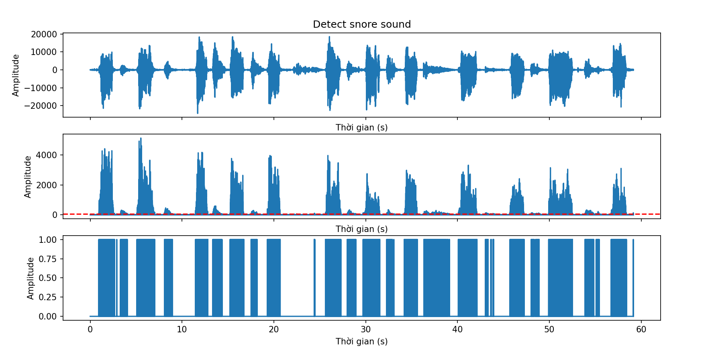

# 1. Algorithm 
- I differentiate the audio signal taking the absolute value of the derivative to get the second graph.
- I average the values ​​of the sound and plot it in red on the second graph.
- Subtract the derivative values ​​of the sound to the red average line. If the difference between the two numbers is greater than zero, assign it as 1. If the difference between the two numbers is less than zero, assign it as 0 and draw the graph on the third chart.

# 2. Result 
- See the 3rd graph, when line in graph is 1, it's mean that at that location there is snores sound.
- If line in graph is 0, it's mean that at that location there isn't snores sound.

